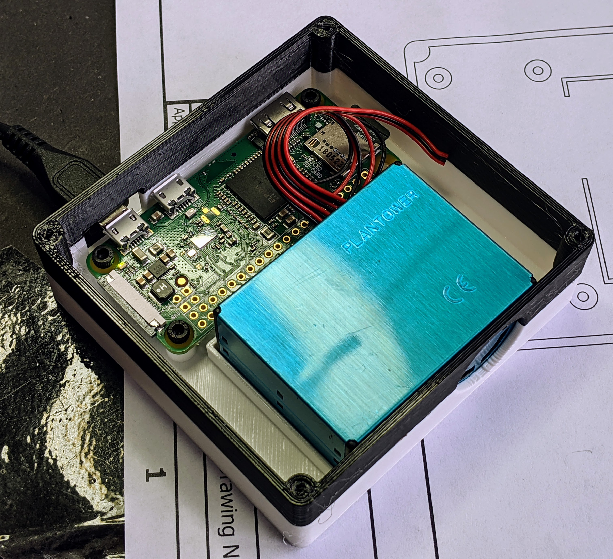
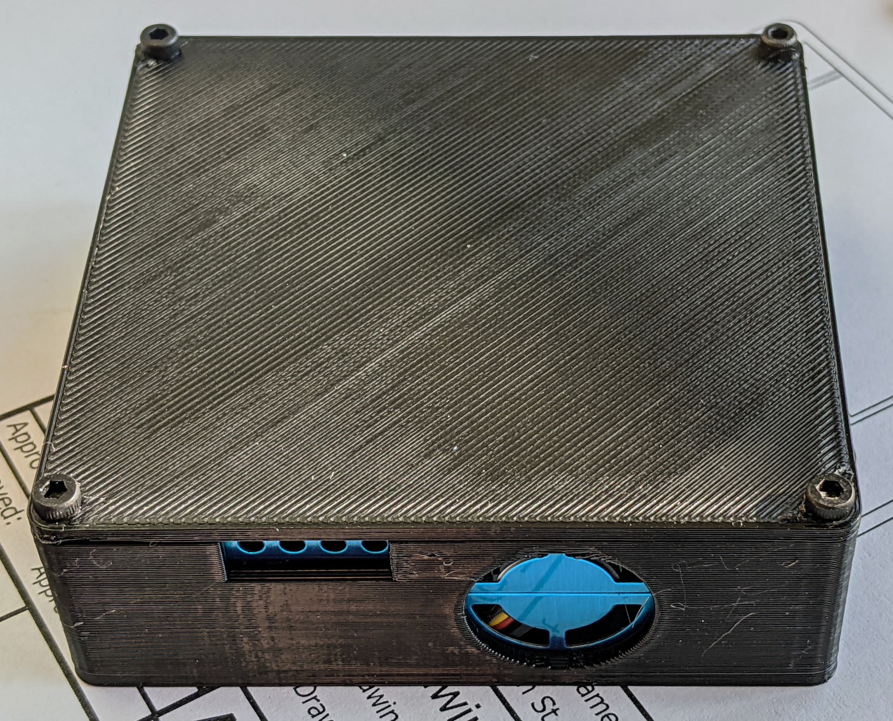
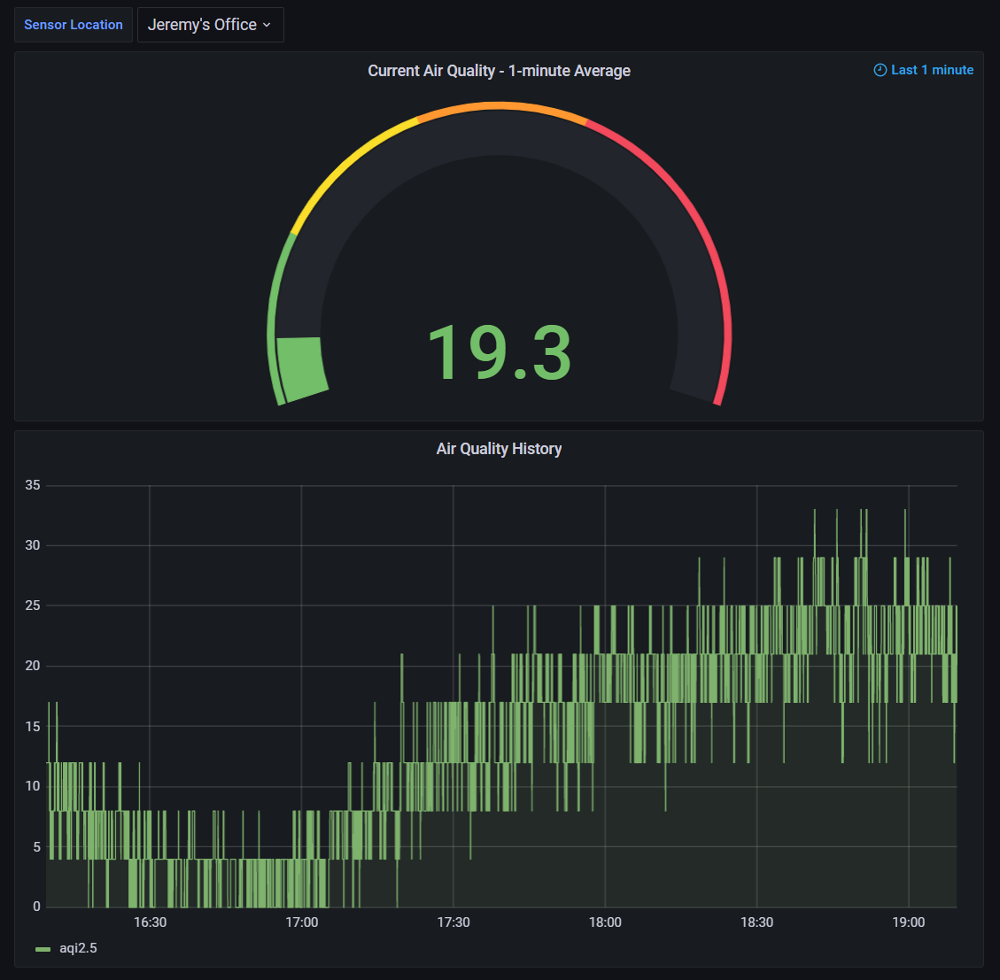

# DIY Air Quality Sensor with Wireless Logging

This is the software for a do-it-yourself air quality sensor system based on the
Plantower PMS5003 particulate sensor, which senses PM1.0, PM2.5 and PM10.0
particulates. Each sensor is connected to a Raspberry Pi Zero W, which
periodically transmits data wirelessly to a small web server. Any number of
sensors are supported. All data is written to a Postgres database, which can be
easily visualized with tools such as Grafana. Also included is a [3D printable
case](https://www.thingiverse.com/thing:4940995) I designed to fit the Pi and
sensor.

## Credits

The PMS5003 parsing code is based on
[Adafruit's](https://learn.adafruit.com/pm25-air-quality-sensor) and
[dgj's](https://github.com/djacobow/airmon) code.

## Hardware

* Buy a PMS5003 sensor. They're sold under various brand names on various sites
  including [Adafruit](https://www.adafruit.com/product/3686) /
  [Mouser](https://www.mouser.com/ProductDetail/Adafruit/3686),
  [Amazon](https://www.amazon.com/gp/product/B092H9FSC9),
  [BangGood](https://usa.banggood.com/PMS5003-PM2_5-Air-Particle-Dust-Sensor-Laser-Digital-Output-Module-High-Precision-Air-Haze-Detection-Smart-Home-Device-p-1553818.html),
  [AliExpress](https://www.aliexpress.com/item/1005001793669306.html), [eBay](https://www.ebay.com/sch/i.html?_from=R40&_trksid=p2047675.m570.l1313&_nkw=pms5003&_sacat=0)...

* Buy a [Raspberry Pi Zero W](https://www.raspberrypi.org/products/raspberry-pi-zero-w/) (the WiFi variant) without headers

* Solder 3 wires from the PMS5003 to the Raspberry Pi. For reference, see the
  diagrams of the [sensor pinout](https://github.com/jelson/aqi/blob/main/docs/pms5003_pinout.png) and [Pi pinout](https://pinout.xyz/).
   * Sensor Pin 1 (VCC) to Pi Pin 4 (5V Power)

   * Sensor Pin 2 (GND) to Pi Pin 6 (GND)

   * Sensor Pin 5 (TXD) to Pi Pin 10 (Serial port RX)

* Optional: 3D print the [case I designed](https://www.thingiverse.com/thing:4940995).
  Attach the Pi to the case's integrated standoffs using 4xM2.5
  machine screws. The cover also attaches to the case using 4xM2.5 screws.

## Software

* Configure the server that receives the data:

    * Install Postgres on your server. Use a SQL script similar to [this
      example](https://github.com/jelson/aqi/blob/main/v3/create-table.sql)
      to create a database and table.

    * Install the receiver service's prereqs on your server: python modules `aqi`
      and `cherrypy`

    * Create a configuration file for the receiver service specifying a password of
      your choice. If you want to use HTTPS (TLS), also specify the path to your
      HTTPS certficate, key, and cert chain.  An example config file can be found
      [here](https://github.com/jelson/aqi/blob/main/v3/netreceiver-config-example.json).

      If you'd rather not use HTTPS, leave the certificate configuration lines out
      of the receiver configuration file. The server will start as HTTP instead of
      HTTPS. If you do this, make sure you use http:// URLs instead of https:// with
      the client tools.

    * Run the receiver service using a command line like `v3/netreceiver.py --config
      /path/to/config-file`. You may wish to use `systemd` to have the service start
      automatically; an example systemd config file is
      [here](https://github.com/jelson/aqi/blob/main/v3/netreceiver.service).

    * Test the receiver. Note that by default it runs on port 15000. Run the unit
      test with a command like

        `v3/test/sendtest.py --url https://your-server:15000/data/ -s 1000 -n 10 -p 'password-you-picked'`

       The return value should be `True`, indicating success. Check the database
       table and ensure it has been populated with 10 rows of data (or whatever
       value you passed to `-n`) tagged with sensor ID 1000 (or whatever value you
       passed to `-s`). A 403 result indicates there was a mismatch between the
       password you passed to sendtest.py and the one in the receiver's
       configuration file.

* Configure each of your RPi sensors:

   * Install Raspian and clone this repo onto it

   * Use `raspi-config` to configure the serial port to be usable for an
     external peripheral rather than a console

   * Run `v3/rpi-reader.py --url https://your-server:15000/data/ -s 1 -p
     'password-you-picked'` The `-s 1` argument is the sensor ID number. If you
     have more than one sensor, give each a unique sensor ID.

   * If it works, arrange to have the Pi start rpi-reader.py automatically on
     each boot by adding it to systemd; an example config file is
  [here](https://github.com/jelson/aqi/blob/main/v3/rpi-reader.service).

   * Check `journalctl -f` to look for log messages. You should see `rpi-reader`
     reporting that it is sending data to the server every 15 seconds.

* Optional: install Grafana (or similar tool) to visualize the data from your
  database.
