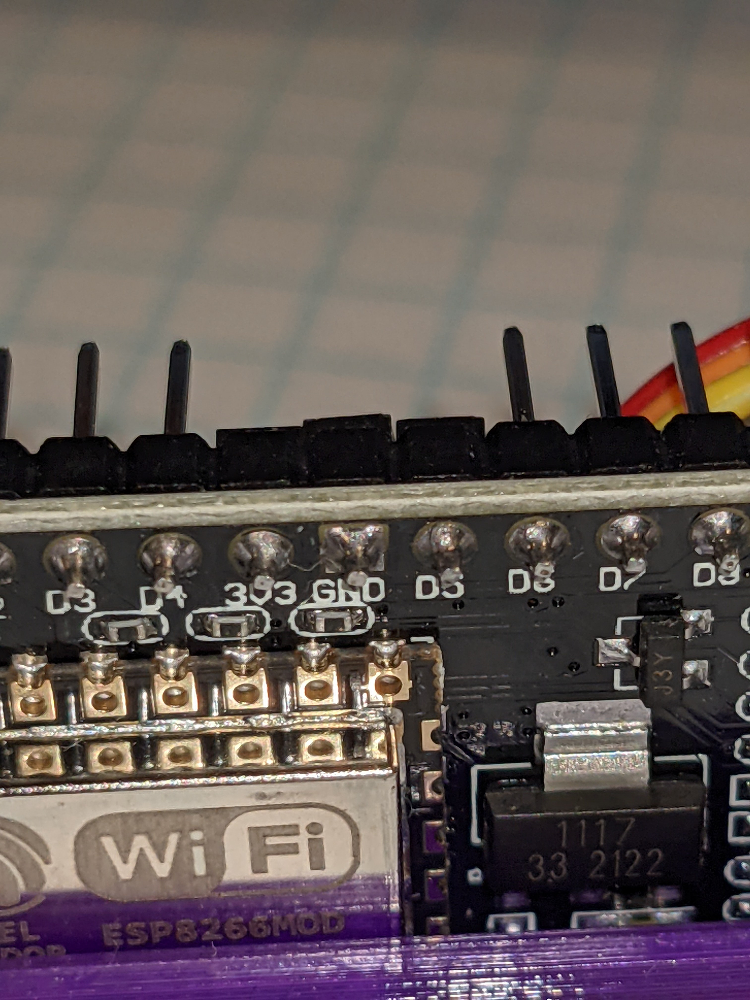
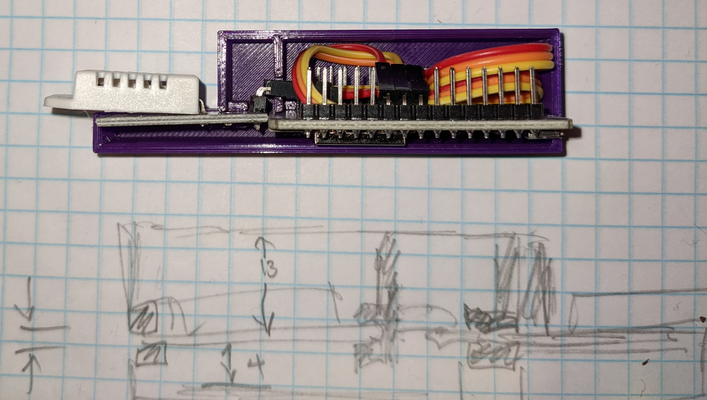

# aqi/esp8266_dht22
This is a Lectrobox Cloud Weather device endpoint based on ESP8266 and DHT22.

## Bill of Materials

Each endpoint requires:

* One [ESP8266 NodeMCU](https://smile.amazon.com/dp/B081CSJV2V?ref=ppx_yo2_dt_b_product_details&th=1)
* One [DHT22](https://smile.amazon.com/dp/B07WP4VZTH?psc=1&ref=ppx_yo2_dt_b_product_details). These include female jumpers, which is handy.
* A USB power supply (50mW is typical, so almost anything should do) and micro-USB cable.

## Case

Print the case .stl parts, vent-side down.

Wire the DHT22 to 3V3, GND, and **D5** on the NodeMCU board.

    

Bundle up the wire and arrange the two boards as shown:

    

Snap the NodeMCU board into the pcb slots in one side of the case.

The DHT22 board snaps into a single slot on the other end of the case,
with its header passing through a slot in the internal heat barrier.

Snap the other side of the case onto the boards, using the alignment pins
to secure the halves together.

## Client configuration

Copy `esp8266_dht22/lectrobox_credentials-example.h`
to `esp8266_dht22/lectrobox_credentials.h`
and fill in the cloud credentials and local
WiFi AP network name-and-password pairs.
Note it's a 2.4GHz WiFi client; don't point it at your 5GHz network.

## Code

* Load `esp8266_dht22/esp8266_dht22.ino` into Arduino IDE.

(TODO I don't know how Arduino records the board info, so I'll write it down
here. But it should be recorded as metadata so it's not a manual step!)

* Tools -> Board -> Board Manager; search; "ESP 8266 Boards (3.0.2)"
* Tools -> Board -> ESP 8266 Boards (3.0.2) -> NodeMCU 1.0 (ESP-12E Module)
* Tools -> CPU Freq -> 80MHz
* Tools -> Flash Size -> 4MB (FS:3MB OTA:~512KB)

* Tools -> Manage Libraries; search; "NTPClient" (3.2.0, Fabrice Weinberg)
* Tools -> Manage Libraries; search; "DHT" -- **TODO** I can't tell which of these three I tried is actually in use:

    * Adafruit Unified Sensor (1.1.4, Adafruit)
    * DHT sensor library (1.4.3, Adafruit)
    * DHT sensor library for ESPx (1.18.0, beegee_tokyo)

* Plug the device into a USB port on your machine.
* Tools -> Port -> "/tty/USB0" (Or however it appears on your system.)
* Tools -> Upload

## Cloud Registration

### Solid blue light

The device is trying to start up. It's either:

* Waiting for WiFi authentication and connection or
* Waiting for its friendly name from the
[nameserver](https://airquality.circlemud.org/recent_lookups).

Register it at the cloud server and reboot the endpoint.

### Morse code signal

In operation, the endpoint blinks its version as a morse code letter.
Right now it's "A" (. -).

## 
